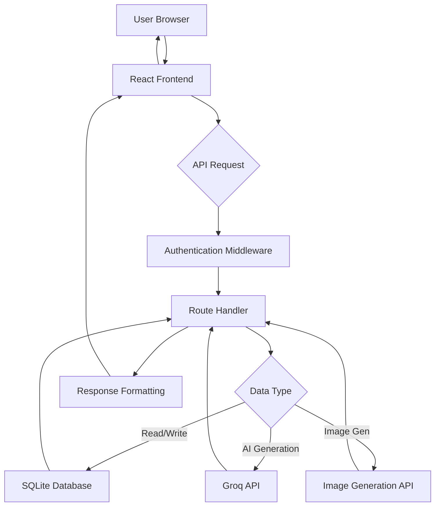

# Aine Learning Aid - System Architecture Design

## Overview
Aine Learning Aid is a web application designed to support Ugandan Competency-Based Assessment (CBA) curriculum through AI-powered learning assistance. The system provides personalized learning experiences aligned with NCDC guidelines, featuring content generation, Q&A support, and optional visual aids.

## System Architecture

### High-Level Components
```
┌─────────────────┐    ┌─────────────────┐    ┌─────────────────┐
│   React Frontend│    │ Express Backend │    │   SQLite DB     │
│  (TypeScript)   │◄──►│  (Node.js)      │◄──►│  (Data Models)  │
│                 │    │                 │    │                 │
│ - Components    │    │ - API Routes    │    │ - Users         │
│ - State Mgmt    │    │ - AI Integration│    │ - Lessons       │
│ - Responsive UI │    │ - Auth          │    │ - Assessments   │
└─────────────────┘    └─────────────────┘    └─────────────────┘
                              │                        │
                              ▼                        ▼
                       ┌─────────────────┐    ┌─────────────────┐
                       │   Groq API      │    │ Image Gen API   │
                       │ (AI Content)    │    │ (Optional)      │
                       └─────────────────┘    └─────────────────┘
```

### Data Flow Diagram


## Project Structure
```
aine-learning-aid/
├── frontend/                 # React/TypeScript app
│   ├── public/
│   ├── src/
│   │   ├── components/       # Reusable UI components
│   │   ├── pages/           # Page components
│   │   ├── hooks/           # Custom React hooks
│   │   ├── services/        # API service functions
│   │   ├── types/           # TypeScript type definitions
│   │   ├── utils/           # Utility functions
│   │   ├── styles/          # Tailwind CSS styles
│   │   └── App.tsx
│   ├── package.json
│   └── tailwind.config.js
├── backend/                  # Node.js/Express server
│   ├── src/
│   │   ├── routes/          # API route handlers
│   │   ├── models/          # Database models
│   │   ├── services/        # Business logic
│   │   ├── middleware/      # Express middleware
│   │   ├── config/          # Configuration files
│   │   └── app.js
│   ├── database/            # SQLite files
│   ├── package.json
│   └── server.js
├── shared/                   # Shared types/interfaces
│   ├── types/
│   └── constants/
├── docs/                     # Documentation
├── tests/                    # Test files
├── docker/                   # Docker configs
└── README.md
```

## Frontend Specifications (React/TypeScript/Tailwind)

### Component Hierarchy
```
App
├── Header
│   ├── Logo
│   ├── Navigation
│   ├── ThemeToggle (Dark/Light)
│   └── UserMenu
├── MainContent
│   ├── Dashboard
│   │   ├── ProgressOverview
│   │   ├── RecentLessons
│   │   └── QuickActions
│   ├── LessonViewer
│   │   ├── LessonHeader
│   │   ├── ContentDisplay
│   │   ├── InteractiveElements
│   │   └── NavigationControls
│   ├── AssessmentInterface
│   │   ├── QuestionDisplay
│   │   ├── AnswerInput
│   │   ├── ProgressIndicator
│   │   └── SubmitControls
│   ├── AIAssistant
│   │   ├── ChatInterface
│   │   ├── ResponseDisplay
│   │   └── ContextSelector
│   └── Settings
│       ├── ProfileSettings
│       ├── LearningPreferences
│       └── AccessibilityOptions
└── Footer
    ├── Links
    └── Copyright
```

### Key Features
- **Mobile-First Responsive Design**: Tailwind CSS with breakpoint utilities
- **Dark Mode Support**: CSS custom properties with theme switching
- **Low-Bandwidth Optimization**:
  - Lazy loading of components
  - Image optimization and WebP format
  - Progressive content loading
  - Offline capability with service workers
- **Accessibility**: ARIA labels, keyboard navigation, screen reader support

## Backend Specifications (Node.js/Express)

### API Endpoints

#### Authentication
- `POST /api/auth/login` - User login
- `POST /api/auth/register` - User registration
- `POST /api/auth/logout` - User logout
- `GET /api/auth/me` - Get current user info

#### User Management
- `GET /api/users/:id` - Get user profile
- `PUT /api/users/:id` - Update user profile
- `GET /api/users/:id/progress` - Get learning progress

#### Content Management
- `GET /api/lessons` - List lessons (filtered by subject/grade)
- `GET /api/lessons/:id` - Get specific lesson
- `POST /api/lessons` - Create custom lesson (admin)
- `PUT /api/lessons/:id` - Update lesson
- `DELETE /api/lessons/:id` - Delete lesson

#### Assessments
- `GET /api/assessments` - List assessments
- `GET /api/assessments/:id` - Get assessment details
- `POST /api/assessments/:id/submit` - Submit assessment answers
- `GET /api/assessments/:id/results` - Get assessment results

#### AI Integration
- `POST /api/ai/generate-content` - Generate lesson content
- `POST /api/ai/answer-question` - Get AI response to question
- `POST /api/ai/generate-image` - Generate visual aid (optional)

### Middleware
- Authentication middleware (JWT)
- Rate limiting
- CORS configuration
- Error handling
- Request logging

## Database Schema (SQLite)

### Tables

#### users
```sql
CREATE TABLE users (
    id INTEGER PRIMARY KEY AUTOINCREMENT,
    email TEXT UNIQUE NOT NULL,
    password_hash TEXT NOT NULL,
    full_name TEXT NOT NULL,
    grade_level TEXT NOT NULL,
    subjects TEXT, -- JSON array of subjects
    preferences TEXT, -- JSON object for settings
    created_at DATETIME DEFAULT CURRENT_TIMESTAMP,
    updated_at DATETIME DEFAULT CURRENT_TIMESTAMP
);
```

#### lessons
```sql
CREATE TABLE lessons (
    id INTEGER PRIMARY KEY AUTOINCREMENT,
    title TEXT NOT NULL,
    subject TEXT NOT NULL,
    grade_level TEXT NOT NULL,
    content TEXT NOT NULL, -- JSON structured content
    competencies TEXT, -- JSON array of CBA competencies
    difficulty TEXT DEFAULT 'medium',
    estimated_time INTEGER, -- minutes
    created_by INTEGER,
    created_at DATETIME DEFAULT CURRENT_TIMESTAMP,
    FOREIGN KEY (created_by) REFERENCES users(id)
);
```

#### assessments
```sql
CREATE TABLE assessments (
    id INTEGER PRIMARY KEY AUTOINCREMENT,
    lesson_id INTEGER,
    title TEXT NOT NULL,
    type TEXT NOT NULL, -- 'quiz', 'practical', 'essay'
    questions TEXT NOT NULL, -- JSON array of questions
    rubric TEXT, -- JSON assessment rubric
    time_limit INTEGER, -- minutes
    created_at DATETIME DEFAULT CURRENT_TIMESTAMP,
    FOREIGN KEY (lesson_id) REFERENCES lessons(id)
);
```

#### user_progress
```sql
CREATE TABLE user_progress (
    id INTEGER PRIMARY KEY AUTOINCREMENT,
    user_id INTEGER,
    lesson_id INTEGER,
    assessment_id INTEGER,
    status TEXT DEFAULT 'not_started', -- 'in_progress', 'completed'
    score REAL,
    completed_at DATETIME,
    notes TEXT,
    UNIQUE(user_id, lesson_id),
    FOREIGN KEY (user_id) REFERENCES users(id),
    FOREIGN KEY (lesson_id) REFERENCES lessons(id),
    FOREIGN KEY (assessment_id) REFERENCES assessments(id)
);
```

#### ai_interactions
```sql
CREATE TABLE ai_interactions (
    id INTEGER PRIMARY KEY AUTOINCREMENT,
    user_id INTEGER,
    type TEXT NOT NULL, -- 'content_generation', 'question_answer', 'image_generation'
    prompt TEXT NOT NULL,
    response TEXT,
    tokens_used INTEGER,
    created_at DATETIME DEFAULT CURRENT_TIMESTAMP,
    FOREIGN KEY (user_id) REFERENCES users(id)
);
```

## AI Integration (Groq API)

### Integration Points
1. **Content Generation**: Generate CBA-aligned lesson content
2. **Question Answering**: Provide explanations and answers to student questions
3. **Assessment Support**: Generate practice questions and feedback

### API Usage
- Use Groq's fast inference for real-time responses
- Implement prompt engineering for CBA curriculum alignment
- Cache responses to reduce API calls and costs
- Rate limiting to prevent abuse

### Example Prompts
```
Content Generation:
"Generate a lesson on photosynthesis for Grade 8 Biology, aligned with Ugandan CBA competencies. Include practical activities using local plant species."

Question Answering:
"Explain the water cycle in the context of Ugandan climate patterns, focusing on competency in environmental stewardship."
```

## Optional Image Generation

### Integration Options
- OpenAI DALL-E API
- Stability AI
- Midjourney API

### Use Cases
- Generate diagrams for science concepts
- Create visual aids for historical events
- Produce illustrations for literature analysis
- Visual representations of mathematical concepts

### Implementation
- Optional feature toggle in settings
- Fallback to text descriptions if disabled
- Optimize image sizes for low-bandwidth
- Cache generated images

## Technical Specifications

### Performance Requirements
- Page load time < 3 seconds on 3G connections
- Support for 1000+ concurrent users
- API response time < 500ms for cached content
- < 2MB initial bundle size

### Security Considerations
- JWT authentication with refresh tokens
- Input validation and sanitization
- Rate limiting on API endpoints
- Secure storage of API keys
- HTTPS enforcement

### Scalability
- Modular architecture for easy extension
- Database indexing for performance
- Caching layer (Redis optional)
- CDN for static assets

### Deployment
- Docker containerization
- Environment-based configuration
- Automated testing pipeline
- Monitoring and logging

This architecture provides a solid foundation for Aine Learning Aid, ensuring alignment with Ugandan CBA requirements while maintaining modern web development best practices.